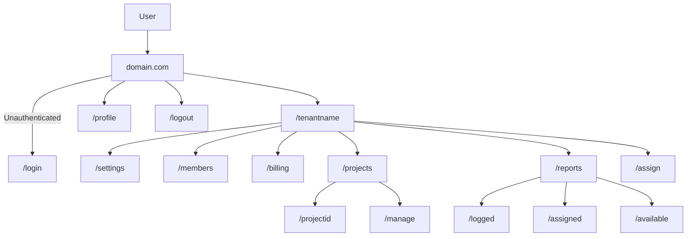

# Overview

## Technology stack

- [Next.js](https://nextjs.org/) for frontend and backend
- [trpc](https://trpc.io/) for API
- [Prisma](https://www.prisma.io/) for database ORM
- Authentication: [NextAuth.js](https://next-auth.js.org/) with Google OAuth
- [MySQL](https://www.mysql.com/) for database (hosted on [PlanetScale](https://planetscale.com/) for development)
- [Tailwind CSS](https://tailwindcss.com/) for styling
- [Lucide](https://lucide.dev/) for icons
- [Radix UI](https://www.radix-ui.com/) and [shadcn](https://ui.shadcn.com/) for UI components
- [Vercel](https://vercel.com/) for hosting

## Folder structure

```
.
├── README.md
├── design
|   └── overview.md                         <- You are here
├── prisma                                  <- Prisma schema
├── public
└── src
    ├── components                          <- UI Components
    |   ├── layout.tsx
    |   ├── navbar.tsx
    |   └── ui                              <- UI Primitives
    |     └── button.tsx
    |     └── command.tsx
    └── config
    └── pages                               <- See sitemap
    └── server
    |     └── api
    |           └── routers                 <- trpc router
    └── styles                              <- Tailwind CSS
    └── utils
```

## Sitemap


